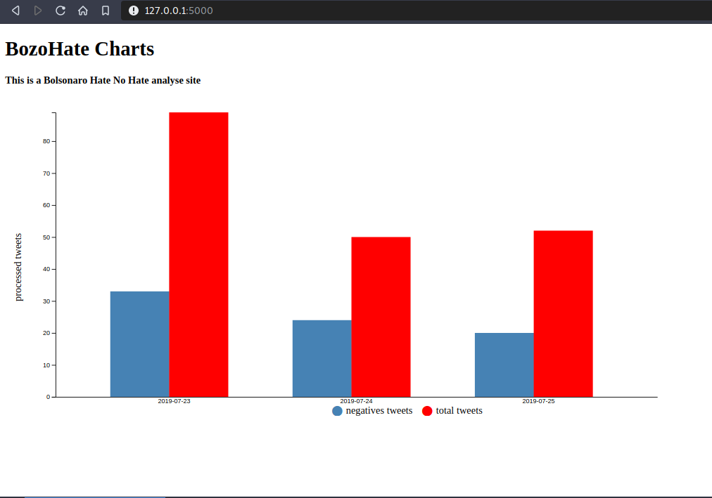

# bozohate
See how many negative tweets President Bolsonaro has per day.

## Screenshot

## Requirements
- Python 3.7
- MongoDB 4.0
- Twitter API token

## Install
 - `$ https://github.com/msAlcantara/bozohate`
 - `$ cd bozohate`
 - `$ python -m venv venv`
 - `$ source venv/bin/activate`
 - `$ pip install -r requirements.txt`

## Environment Variables Configuration
You can set this environment variables or create a `.env` file like the `.env_template` file in this repository
 - FLASK_DEBUG
 - MONGO_URI
 - CONSUMER_KEY
 - CONSUMER_SECRET
 - ACCESS_TOKEN
 - ACCESS_TOKEN_SECRET

## Run
 - `$ export FLASK_APP=bozohate`
 - `$ flask run`

## Populate database
 To get tweets from twitter:
   - `$ flask update`
 
 To compute values to see them in frontend:
   - `$ flask compute`

## License
 [MIT](https://raw.githubusercontent.com/msAlcantarabozohate/master/LICENSE) license.